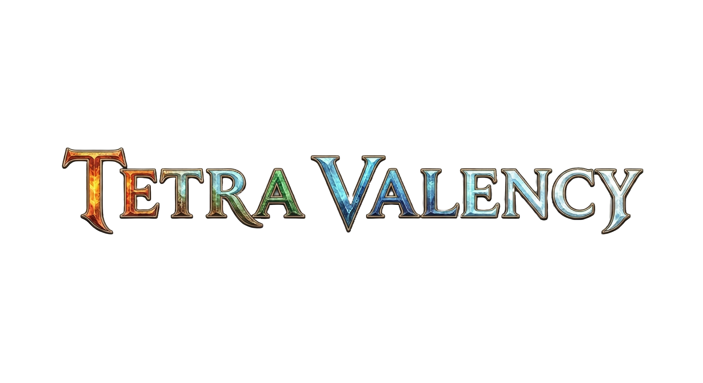

# Tetra Valency

  

A LibGDX-based tower defense game centered around element-combining mechanics.
The player places towers on the map, powers them up with the orb system, and keeps the defense alive
through economy and positioning decisions across enemy waves.

## Game Overview

- Genre: Tower Defense
- Engine: LibGDX (Java)
- Platform: Desktop (LWJGL3)
- Core loop:
  - Map selection
  - Tower placement
  - Elemental Orb collection / merging
  - Wave management
  - Build progression with augment choices

## Core Features

- 2 maps:
  - Elemental Castle
  - Desert Oasis
- Tower types:
  - Rapid
  - Power
  - Sniper
- Element/Orb system:
  - Base and hybrid elements
  - Progression through inventory + merge board
- In-game screens:
  - Intro
  - Main Menu
  - Map Select
  - Game Screen
  - Leaderboard screens
  - Options / Credits / Endgame
